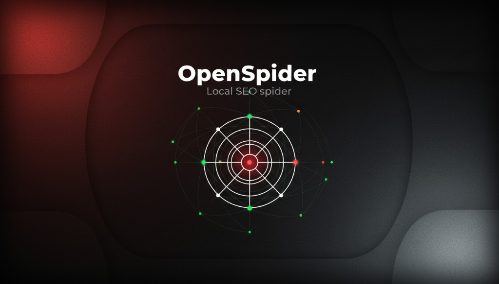

# OpenSpider

**[Русский](#русский)** · **[English](#english)**

Десктопный SEO-spider и хаб метрик. Безлимитный локальный обход, отчёты и интеграции — на вашей машине. Open source, MIT.

Desktop SEO spider and metrics hub. Unlimited local crawl, reports and integrations on your machine. Open source, MIT.

---

## Русский

**OpenSpider** — приложение для технического SEO, которое работает целиком на вашем компьютере. Один инструмент вместо связки «краулер + таблицы + отчёты + внешние сервисы»: обход сайта, поиск проблем, сводка по здоровью, история прогонов, экспорт и сравнение отчётов, метрики из Search Console, Вебмастера, Метрики, PageSpeed и других источников.

Данные не уходят в облако по умолчанию. Нет квот на число URL, как у SaaS и бесплатного Screaming Frog.

### Для кого

- **In-house и agency SEO** — аудит сайтов клиентов без лимита URL и без счётчика кредитов.
- **Технические маркетологи и владельцы сайтов** — понятная картина индексации, контента и ссылок в одном окне.
- **Команды, которым важна приватность** — краул и отчёты остаются локально.

### Зачем OpenSpider

| Боль | Решение |
|------|---------|
| Бесплатный Screaming Frog — потолок 500 URL | Полноценный обход без лимита URL |
| SaaS-сервисы считают кредиты и токены | Local-first: всё на вашей машине |
| GSC, Метрика и краул живут в разных вкладках | Единый десктоп-хаб для технического SEO |

### Что умеет

#### Обход и структура сайта

| | |
|---|---|
| HTTP-обход | Статусы, редиректы, глубина, входящие и исходящие ссылки, сегменты URL |
| Уважение к robots.txt | Настраиваемый User-Agent, seed из sitemap, list mode, form auth |
| Визуализация | Граф внутренних ссылок по результатам краула |
| Googlebot view | Fetch как Googlebot: desktop / mobile, язык, hreflang, noindex |

#### Индексация и on-page

| | |
|---|---|
| Индексация | noindex, конфликты robots meta, canonical (отсутствует / чужой домен / noindex mismatch) |
| Soft-404 | HTTP 200 со сигналами «страница не найдена» |
| Title и description | Отсутствие, длина, дубликаты по сайту |
| Заголовки | H1 (нет / несколько), H2 на контентных страницах |
| Соцсети | Open Graph и Twitter Cards — превью в интерфейсе и отчётах |
| International | hreflang (missing, не reciprocal), атрибут `lang` |
| Mobile | viewport meta |

#### Контент, ссылки и разметка

| | |
|---|---|
| Контент | Thin content, exact / near duplicates, эвристики качества текста |
| Ссылки | Orphan pages, глубокие URL, inlinks / outlinks, локальные метрики |
| Broken URLs | 4xx/5xx для URL, попавших в обход *(полная проверка всех outbound-ссылок — в roadmap)* |
| JSON-LD | Missing / invalid / weak schema, типы разметки |
| Local SEO | NAP в LocalBusiness / Organization |
| Доступность | img без alt, skip-link, элементы без accessible name |
| GEO | Наличие `llms.txt` на origin |

#### Скорость, SERP и риски

| | |
|---|---|
| PageSpeed | PageSpeed Insights и Lighthouse — через API или локальный Chromium |
| SERP | Probe Google, Bing, Yandex, DuckDuckGo: позиции, site:, archive signal |
| Rank history | История позиций после probe |
| Shadow risk | Эвристика слабой индексации (SERP + crawl + llms) |
| Рекомендации | Actionable items из issues, метрик и shadow risk |
| Health score | Общий балл, прогресс исправлений, доля indexable, средняя глубина |

#### Превью, отчёты и интеграции

| | |
|---|---|
| SERP preview | Pixel-ish snippet title / description |
| Social preview | Facebook / Telegram cards, og / twitter image |
| GSC, Вебмастер, GA4 | Overlay из CSV *(live OAuth — в roadmap)* |
| Яндекс Метрика | API overlay по counter + token |
| Backlinks | Overlay из CSV |
| История | Автоархив прогонов, сравнение двух отчётов |
| Экспорт | JSON, CSV (Looker Studio), PDF с health, issues, SERP, рекомендациями |
| Sitemap | Генерация XML из URL краула |

#### Labs и автоматизация

| | |
|---|---|
| Full audit | Crawl + Lighthouse + SERP + previews + llms — один прогон |
| Custom tools | Regex / CSS / JS по сохранённому HTML; AI-scan; IndexNow |
| Расписание | Hourly / daily, пока приложение открыто |

**Честно о границах:** outbound broken links — только статусы URL в обходе; GSC / Вебмастер / GA4 — CSV-импорт до live API; near-duplicates — эвристика similarity, не SimHash уровня Screaming Frog; scheduling — без фонового daemon.

### Скачать

Готовые сборки для Windows — на странице **[Releases](https://github.com/OpenSpiderSeo/app/releases)**.

Интерфейс на русском и английском.

### В перспективе

OAuth для GSC и Метрики, SQLite для истории, фоновое расписание, live outbound link checker, organic rank tracker.

### Лицензия

[MIT](./LICENSE) · Copyright (c) 2026 OpenSpider Contributors

---

## English

**OpenSpider** is a desktop app for technical SEO that runs entirely on your computer. One tool instead of juggling a crawler, spreadsheets, reports, and scattered SaaS tabs: site crawl, issue detection, health summary, run history, export and compare reports, and metrics from Search Console, Yandex Webmaster, Metrika, PageSpeed, and more.

Data stays local by default. No URL quotas like SaaS tools or the free tier of Screaming Frog.

### Who it's for

- **In-house and agency SEO** — audit client sites without URL caps or credit meters.
- **Technical marketers and site owners** — a clear picture of indexation, content, and links in one window.
- **Teams that care about privacy** — crawls and reports never leave your machine unless you export them.

### Why OpenSpider

| Pain | Answer |
|------|--------|
| Free Screaming Frog caps at 500 URLs | Full crawl with no URL limit |
| SaaS tools meter credits and tokens | Local-first on your machine |
| GSC, Metrika, and crawl live in separate tabs | One desktop hub for technical SEO |

### What it does

#### Crawl and site structure

| | |
|---|---|
| HTTP crawl | Status codes, redirects, depth, in/out links, URL segments |
| robots.txt | Configurable User-Agent, sitemap seed, list mode, form auth |
| Visualization | Internal link graph from crawl results |
| Googlebot view | Fetch as Googlebot: desktop / mobile, language, hreflang, noindex |

#### Indexation and on-page

| | |
|---|---|
| Indexation | noindex, robots meta conflicts, canonical (missing / off-origin / noindex mismatch) |
| Soft-404 | HTTP 200 with “not found” signals |
| Title and description | Missing, length, site-wide duplicates |
| Headings | H1 (missing / multiple), H2 on content-rich pages |
| Social | Open Graph and Twitter Cards — previews in UI and reports |
| International | hreflang (missing, not reciprocal), `lang` attribute |
| Mobile | viewport meta |

#### Content, links, and markup

| | |
|---|---|
| Content | Thin content, exact / near duplicates, text quality heuristics |
| Links | Orphan pages, deep URLs, inlinks / outlinks, local metrics |
| Broken URLs | 4xx/5xx for URLs discovered in the crawl *(full outbound link checker — on the roadmap)* |
| JSON-LD | Missing / invalid / weak schema, schema types |
| Local SEO | NAP in LocalBusiness / Organization |
| Accessibility | Images missing alt, skip-link, elements without accessible names |
| GEO | `llms.txt` presence on origin |

#### Performance, SERP, and risk

| | |
|---|---|
| PageSpeed | PageSpeed Insights and Lighthouse — API or local Chromium |
| SERP | Probe Google, Bing, Yandex, DuckDuckGo: ranks, site:, archive signal |
| Rank history | Position history after probe |
| Shadow risk | Weak indexation heuristic (SERP + crawl + llms) |
| Recommendations | Actionable items from issues, metrics, and shadow risk |
| Health score | Overall score, fix progress, indexable share, average depth |

#### Previews, reports, and integrations

| | |
|---|---|
| SERP preview | Pixel-ish title / description snippet |
| Social preview | Facebook / Telegram cards, og / twitter image |
| GSC, Webmaster, GA4 | CSV overlay *(live OAuth — on the roadmap)* |
| Yandex Metrika | API overlay via counter + token |
| Backlinks | CSV overlay |
| History | Auto-archived runs, compare two reports |
| Export | JSON, CSV (Looker Studio), PDF with health, issues, SERP, recommendations |
| Sitemap | XML generation from crawled URLs |

#### Labs and automation

| | |
|---|---|
| Full audit | Crawl + Lighthouse + SERP + previews + llms in one run |
| Custom tools | Regex / CSS / JS on stored HTML; AI scan; IndexNow |
| Scheduling | Hourly / daily while the app is open |

**Honest limits:** outbound broken links = status of crawled URLs only; GSC / Webmaster / GA4 = CSV import until live API; near-duplicates = similarity heuristic, not Screaming Frog–grade SimHash; scheduling = no background daemon.

### Download

Windows installers are on **[Releases](https://github.com/OpenSpiderSeo/app/releases)**.

Interface in Russian and English.

### On the horizon

OAuth for GSC and Metrika, SQLite for history, background scheduling, live outbound link checker, organic rank tracker.

### License

[MIT](./LICENSE) · Copyright (c) 2026 OpenSpider Contributors
